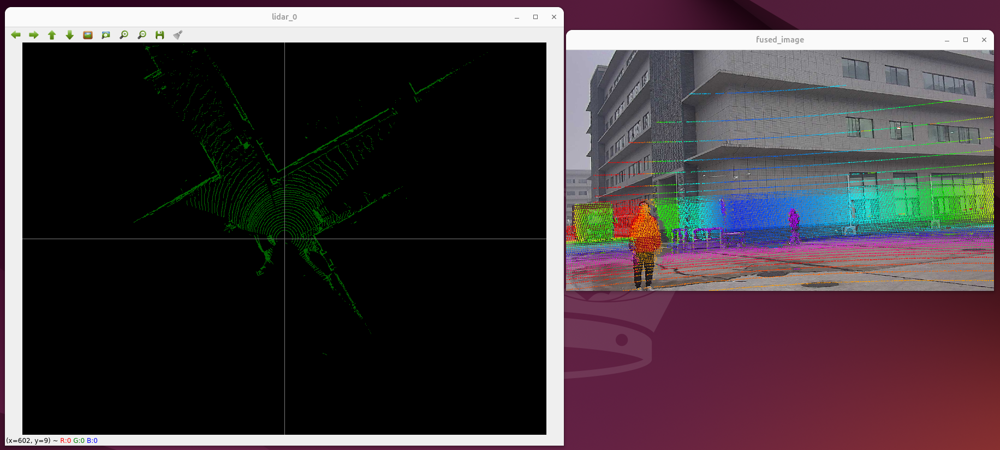
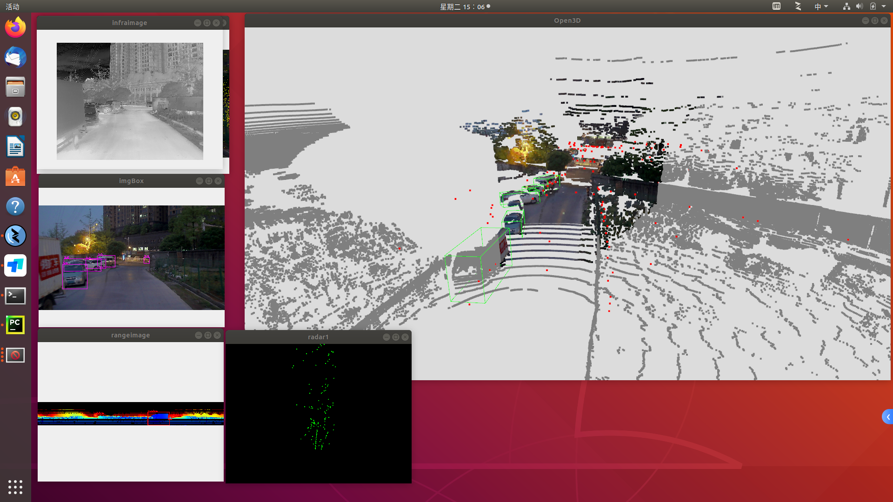
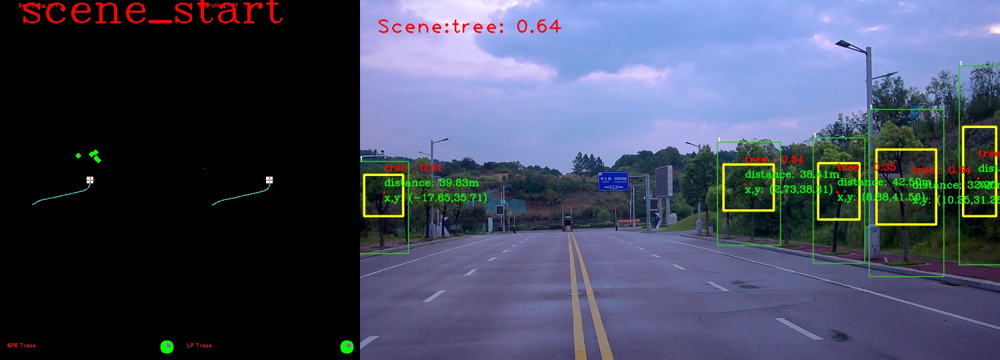
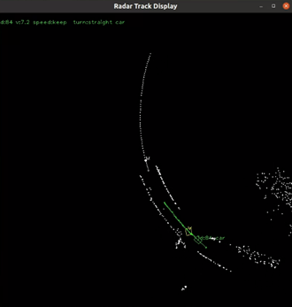
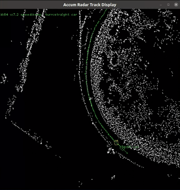

# CodexOpen
An engineering project by XXXX
=======

## Introduction
**CodexOpen** is an open source project for autonomous driving. It is a platform for developers to **build** and **deploy** autonomous driving solutions. The project includes a variety of tools and technologies for autonomous driving, such as **perception**, **planning**, control, and simulation. The project is designed to be **modular** and **extensible**, allowing developers to easily add new features and components to the platform.

详细介绍：[CodexOpen](./docs/02_Quick_Start/)

## Quick Install
The docker image is not available as `Dockerfile` yet, so you need to build it yourself. or use this docker image [QuakPanLink]()

### Docker build this project
详细介绍：[工程安装说明](./docs/安装指南/工程安装说明.md)

## Features
- [X] Perception: Object detection, tracking, and recognition
- [ ] Planning: Path planning, trajectory planning, and behavior planning
- [ ] Control: Vehicle control, including acceleration, steering, and braking
- [ ] Data Analysis：

## Demo
- [ ] 自动标定：

- [ ] 数据库构建：

- [ ] 图像检测定位：

- [ ] 毫米波点云动态目标跟踪：

  
  

- 实装列表详细见 [CHECKLIST](./CHECKLIST.md) ，短横线之前的模块。
- 更新计划详细见 [UPDATE](./UPDATE.md)

## Reference Code
- 工程结构搭建：[apollo](https://github.com/ApolloAuto/apollo.git)
- Docker 环境搭建：[vscode_ros2_workspace](https://github.com/athackst/vscode_ros2_workspace.git), [dockerfiles](https://github.com/athackst/dockerfiles.git)
- ROS1/ROS2 环境搭建：[fishros](https://github.com/fishros/install.git)
- Autoware 环境搭建：[autoware](https://github.com/autowarefoundation/autoware.git)
- Apollo CMAKE 环境搭建：[easy_apollo](https://github.com/pickteemo/easy_apollo.git)、[CyberRT](https://github.com/minhanghuang/CyberRT.git)
- 速腾激光雷达驱动：[rslidar_sdk](https://github.com/RoboSense-LiDAR/rslidar_sdk.git)
- NVIDIA 开发板系统基础：[rootOnNVMe](https://github.com/jetsonhacks/rootOnNVMe.git)
