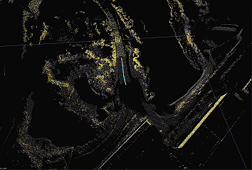
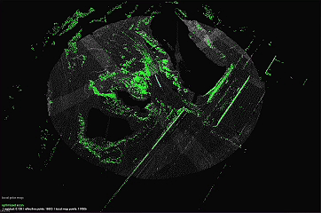
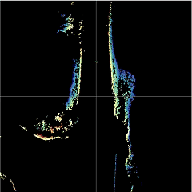

# CodexOpen
An engineering project by XXXX
=======

## Introduction
**CodexOpen** is an open source project for autonomous driving. It is a platform for developers to **build** and **deploy** autonomous driving solutions. The project includes a variety of tools and technologies for autonomous driving, such as **perception**, **planning**, control, and simulation. The project is designed to be **modular** and **extensible**, allowing developers to easily add new features and components to the platform.

详细介绍：[CodexOpen](./docs/框架设计/CodexOpen模块详解.md)

## Quick Install
The docker image is not available as `Dockerfile` yet, so you need to build it yourself. or use **the prebuilt Docker image** instead.  - [QuakPanLink](https://pan.quark.cn/s/a6dc030c7b97) && 提取码：2PLZ：（**Download links are often hidden. If not, please check the individual files. If still unavailable, please open an issue.**）
- X86_ROS1 [QuakPanLink](https://pan.quark.cn/s/c34d89b26766) && 提取码：5UD3
- X86_ROS2 [QuakPanLink](https://pan.quark.cn/s/cf02277ee077) && 提取码：T66p
- ARM_ROS2 [QuakPanLink](https://pan.quark.cn/s/d605b1e20c45) && 提取码：9bk6

### Use JOJO's Docker Image
1. Install `VsCode` && `Dev Containers` plugins
2. Open `CodexOpen/docker/vscode/jojo-deploy-ros1` in VsCode, for ros2 using `jojo-deploy-ros2`.
3. Edit `.devcontainer/devcontainer.json`, taking into account your own machine environment :
```JSON
...
"workspaceMount": "source=/media/jojo/AQiDePan/CodexOpen,target=/workspaces/CodexOpen,type=bind",
...

  "--volume=/home/jojo/Workspace/CodexOpenExtra:/workspaces/CodexOpenExtra",
  "--volume=/home/jojo/Workspace/CodexOpenData:/workspaces/CodexOpenData",
...
  "--runtime=nvidia",
  "--gpus=all"
...
```
4. `Ctrl + Shift + P`, `Dev Containers: Rebuild and Reopen in Container`

### Docker build this project
If you want to compile the image yourself, please refer to the "Image Building" related documentation.
详细介绍：
- [工程安装说明](./docs/安装指南/工程安装说明.md)
- [docker构建](./docs/安装指南/docker/docker_CodexOpen.md)

### Build CodexOpen in docker

详细介绍：
[02_Quick_Start](./docs/02_Quick_Start/02_Quick_Start.md)

#### Diff to Apollo
**把 Apollo 从“一体化系统”降级为“算法库”**；转向 **ROS1**、**ROS2**、**DDS**；

## Features
- [X] Localization: odometry, map_localization
- [X] Perception: object detection, tracking, and recognition
- [ ] Planning: path planning, trajectory planning, and behavior planning
- [ ] Control: vehicle control, including acceleration, steering, and braking
- [x] Data Analysis：map_center_view

## Demo
- [x] 自动标定--图像内参
  - [x] 普通相机
    <div style="display:flex; justify-content:center; align-items:center; gap:10px;">
      
      
    </div>

  - [x] 鱼眼相机
    <div style="display:flex; justify-content:center; align-items:center; gap:10px;">
      
      
    </div>

  - [x] LSD 点集线性度分析校验
    <div style="display:flex; justify-content:center; align-items:center; gap:10px;">
      
    </div>

- [x] 自动标定--图像和雷达外参：
<div style="display:flex; justify-content:center; align-items:center; gap:10px;">
  
  
</div>

- [x] 数据库构建：
<div style="display:flex; justify-content:center; align-items:center; gap:10px;">
  
  
</div>

- [ ] 定位：
  - [x] fast-lio 雷达+IMU里程计
    <div style="display:flex; justify-content:center; align-items:center; gap:10px;">
      
    </div>
  - [x] fast-lio 高精地图+局部观测
    <div style="display:flex; justify-content:center; align-items:center; gap:10px;">
      
    </div>
  
- [ ] 图像检测定位：
  - [x] frame 检测定位
    <div style="display:flex; justify-content:center; align-items:center; gap:10px;">
      
      
    </div>

  - [ ] global 轨迹跟踪
    <div style="display:flex; justify-content:center; align-items:center; gap:10px;">
      
    </div>

- [ ] 毫米波点云动态目标跟踪：
<div style="display:flex; justify-content:center; align-items:center; gap:10px;">
  
  
</div>

- [ ] 点云地图：
  - [x] 三维建图、彩色建图与道路边缘表征
    <div style="display:flex; justify-content:center; align-items:center; gap:10px;">
      
      
    </div>
    
  - [x] Rolling Map：地面滤除
    <div style="display:flex; justify-content:center; align-items:center; gap:10px;">
      
      
    </div>
---

- 实装列表详细见 [CHECKLIST](./docs/CHECKLIST.md) ，短横线之前的模块。
- 更新计划详细见 [UPDATE](./docs/UPDATE.md)

---

## Reference Code
- 工程结构搭建：[apollo](https://github.com/ApolloAuto/apollo.git)
- Docker 环境搭建：[vscode_ros2_workspace](https://github.com/athackst/vscode_ros2_workspace.git), [dockerfiles](https://github.com/athackst/dockerfiles.git)
- ROS1/ROS2 环境搭建：[fishros](https://github.com/fishros/install.git)
- Autoware 环境搭建：[autoware](https://github.com/autowarefoundation/autoware.git)
- Apollo CMAKE 环境搭建：[easy_apollo](https://github.com/pickteemo/easy_apollo.git)、[CyberRT](https://github.com/minhanghuang/CyberRT.git)
- 速腾激光雷达驱动：[rslidar_sdk](https://github.com/RoboSense-LiDAR/rslidar_sdk.git)
- NVIDIA 开发板系统基础：[rootOnNVMe](https://github.com/jetsonhacks/rootOnNVMe.git)

## Version

本项目采用 **CalVer (vYYYY.MM.DD)** 版本命名规范。

- **Current Version**: `v2026.08.17`
- **Recent Update**: 完成启动链模块纯核心与 ROS1 接口拆分，支持无 ROS 核心构建。
- 详细的历史版本更新日志请参阅 [CHANGELOG](./CHANGELOG.md)。
