# CodexOpen
An engineering project by XXXX
=======

## Introduction
**CodexOpen** is an open source project for autonomous driving. It is a platform for developers to **build** and **deploy** autonomous driving solutions. The project includes a variety of tools and technologies for autonomous driving, such as **perception**, **planning**, control, and simulation. The project is designed to be **modular** and **extensible**, allowing developers to easily add new features and components to the platform.

详细介绍：[CodexOpen](./docs/02_Quick_Start/02_Quick_Start.md)

## Quick Install
The docker image is not available as `Dockerfile` yet, so you need to build it yourself. or use the prebuilt Docker image instead.  - [QuakPanLink](https://pan.quark.cn/s/bae27437d0af) && 提取码： KV1x 

### Use JOJO's Docker Image
1. Install `VsCode` && `Dev Containers` plugins
2. Open `CodexOpen/docker/vscode/jojo-deploy-ros1` in VsCode, for ros2 using `jojo-deploy-ros2`.
3. Edit `.devcontainer/devcontainer.json`, taking into account your own machine environment :
```JSON
...
"workspaceMount": "source=/media/jojo/AQiDePan/CodexOpen,target=/workspaces/CodexOpen,type=bind",
...

  "--volume=/home/jojo/Workspace/CodexOpenExtra:/workspaces/CodexOpenExtra",
  "--volume=/home/jojo/Workspace/CodexOpenData:/workspaces/CodexOpenData",
  "--volume=/media/jojo/WorkStation/test:/workspaces/CodexOpenExtraData",
...
  "--runtime=nvidia",
  "--gpus=all"
...
```
4. `Ctrl + Shift + P`, `Dev Containers: Rebuild and Reopen in Container`

### Docker build this project
If you want to compile the image yourself, please refer to the "Image Building" related documentation.
详细介绍：
- [工程安装说明](./docs/安装指南/工程安装说明.md)
- [docker构建](./docs/安装指南/docker/docker_CodexOpen.md)

### Diff to Apollo
**把 Apollo 从“一体化系统”降级为“算法库”**；转向 **ROS2**；

## Features
- [X] Perception: Object detection, tracking, and recognition
- [ ] Planning: Path planning, trajectory planning, and behavior planning
- [ ] Control: Vehicle control, including acceleration, steering, and braking
- [ ] Data Analysis：

## Demo
- [x] 自动标定--图像内参
  - [x] 普通相机
    <div style="display:flex; justify-content:center; align-items:center; gap:10px;">
      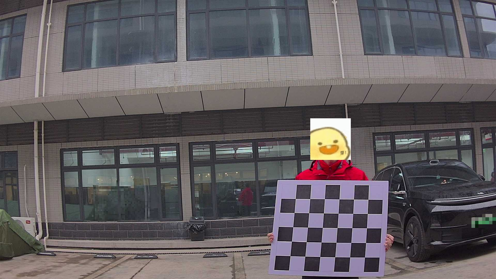
      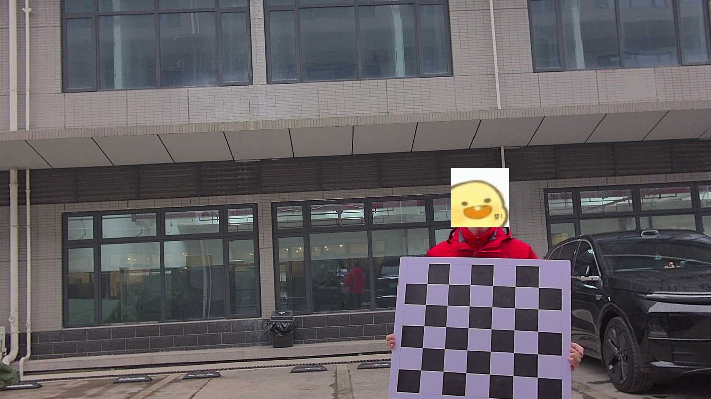
    </div>

  - [x] 鱼眼相机
    <div style="display:flex; justify-content:center; align-items:center; gap:10px;">
      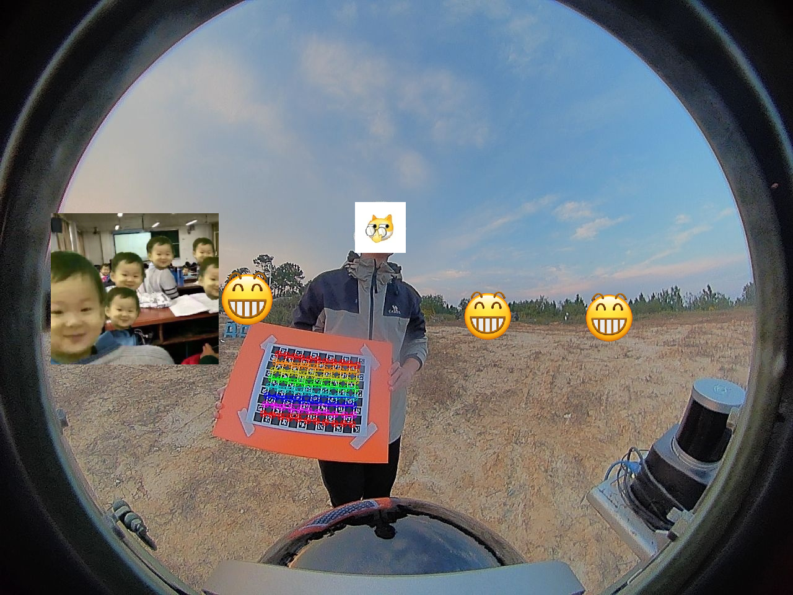
      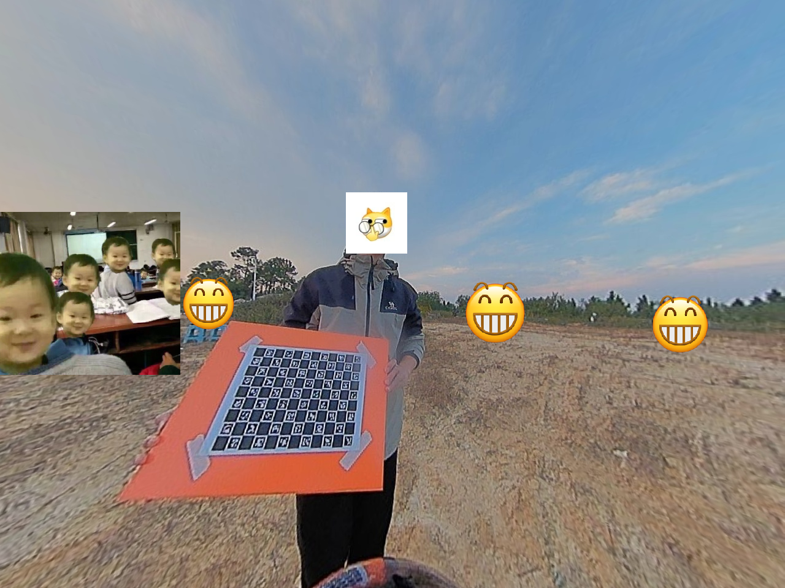
    </div>

  - [x] LSD 点集线性度分析校验
    <div style="display:flex; justify-content:center; align-items:center; gap:10px;">
      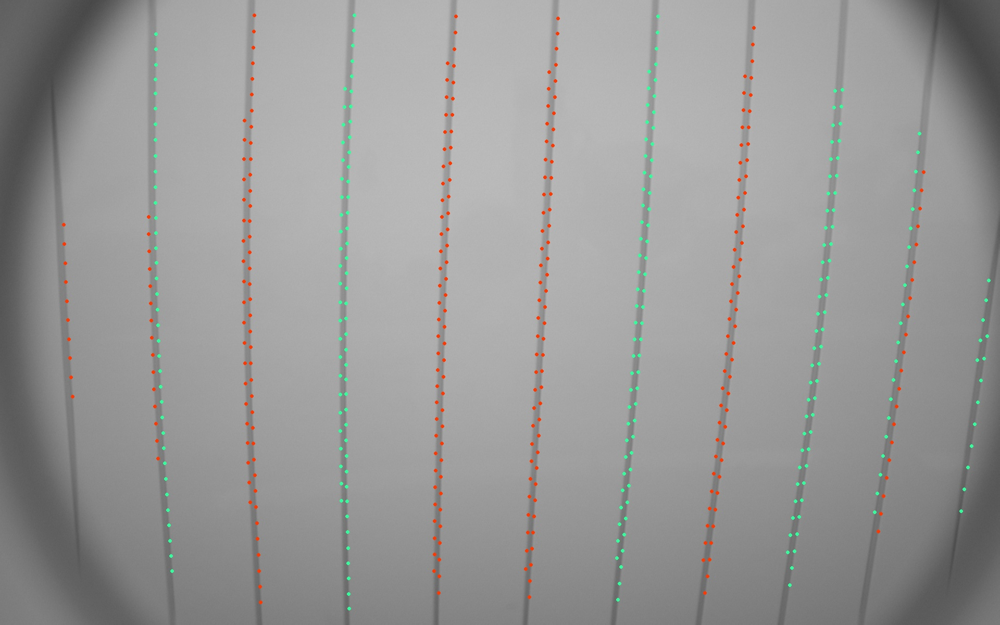
    </div>

- [ ] 自动标定--图像和雷达外参：
<div style="display:flex; justify-content:center; align-items:center; gap:10px;">
  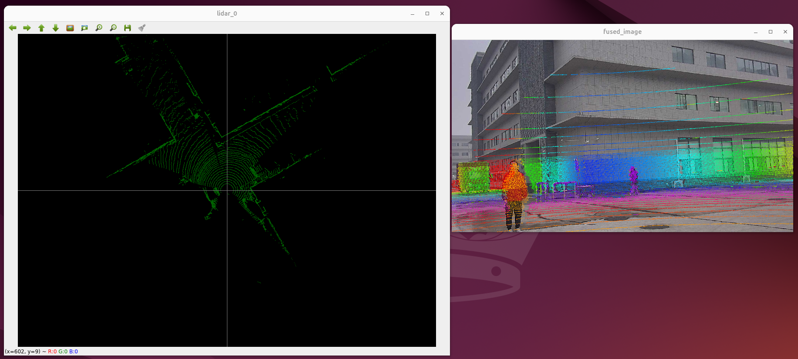
  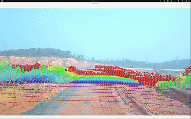
</div>

- [ ] 数据库构建：
<div style="display:flex; justify-content:center; align-items:center; gap:10px;">
  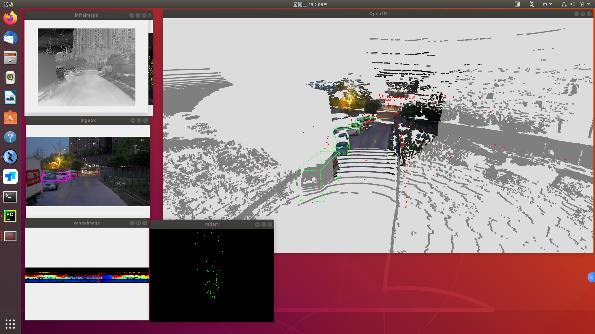
  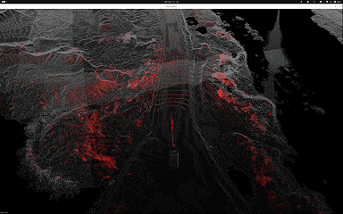
</div>

- [ ] 图像检测定位：
  - [x] frame 检测定位
    <div style="display:flex; justify-content:center; align-items:center; gap:10px;">
      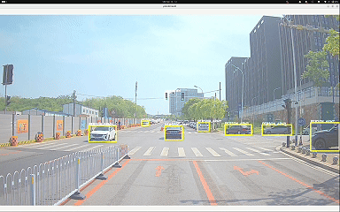
      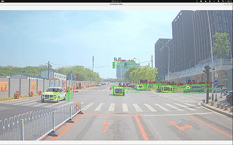
    </div>

  - [ ] global 轨迹跟踪
    <div style="display:flex; justify-content:center; align-items:center; gap:10px;">
      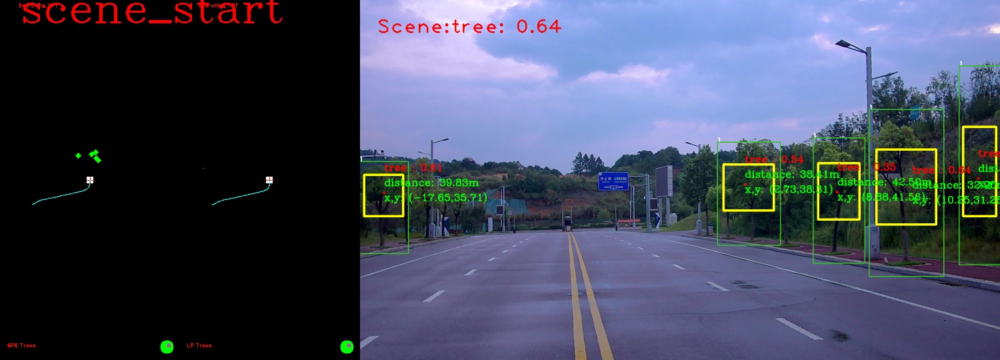
    </div>

- [ ] 毫米波点云动态目标跟踪：
<div style="display:flex; justify-content:center; align-items:center; gap:10px;">
  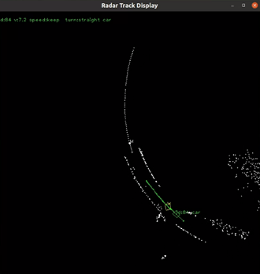
  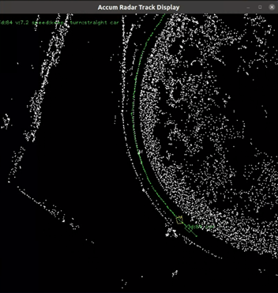
</div>

- [ ] 点云地图：
  - [x] 三位建图、彩色建图与道路边缘表征
    <div style="display:flex; justify-content:center; align-items:center; gap:10px;">
      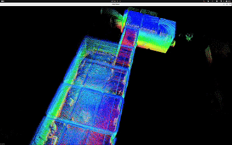
      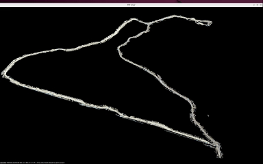
      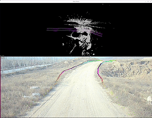
    </div>

  - [x] Stanford Rolling Map
    <div style="display:flex; justify-content:center; align-items:center; gap:10px;">
      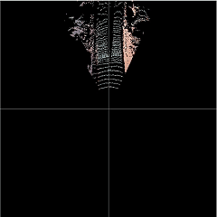
    </div>
---

- 实装列表详细见 [CHECKLIST](./docs/CHECKLIST.md) ，短横线之前的模块。
- 更新计划详细见 [UPDATE](./docs/UPDATE.md)

---

## Reference Code
- 工程结构搭建：[apollo](https://github.com/ApolloAuto/apollo.git)
- Docker 环境搭建：[vscode_ros2_workspace](https://github.com/athackst/vscode_ros2_workspace.git), [dockerfiles](https://github.com/athackst/dockerfiles.git)
- ROS1/ROS2 环境搭建：[fishros](https://github.com/fishros/install.git)
- Autoware 环境搭建：[autoware](https://github.com/autowarefoundation/autoware.git)
- Apollo CMAKE 环境搭建：[easy_apollo](https://github.com/pickteemo/easy_apollo.git)、[CyberRT](https://github.com/minhanghuang/CyberRT.git)
- 速腾激光雷达驱动：[rslidar_sdk](https://github.com/RoboSense-LiDAR/rslidar_sdk.git)
- NVIDIA 开发板系统基础：[rootOnNVMe](https://github.com/jetsonhacks/rootOnNVMe.git)
