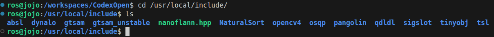

## CodexOpen

- [x] x86 镜像
- [ ] arm 镜像
- [x] ros1 镜像需要兼容 apollo、ros1、
- [ ] ros2 镜像需要兼容 apollo、ros2、autoware

## 容器构建

构建方式，采用多阶段构建，最后纯净镜像输出；

- 20260121：为了快速迭代，目前采用 [简单版：当前操作过的容器导出新镜像]

详细见：
- [多阶段构建](./多阶段构建.md)
- [手动迁移纯净镜像](./手动迁移纯净镜像.md)

## 构建步骤

- [x] 下载 `osrf ros` ==> 第三方 `althack` 官方的基础镜像 : `FROM althack/ros2:humble-full`
  - [x] `tag`重新打包准备相关基础镜像：`x86` && `aarch64`
  - [ ] 使用 `ubuntu base`镜像，手动搭建，再导出，替换对 第三方 `althack` 镜像的使用
- [x] 加载为 容器，修改为国内软件源 : 
  - [x] 在容器中手动配置好新的软件源；详细见 [基础容器构建](./基础容器构建.md)
- [x] 安装基础软件 : wget、curl 、openssh-sever等
- [x] 安装进阶软件 : ros、python3-pip
- [x] 使用 `fishros` 更新 `ros` 版本
  - [x] 安装必须的相关 ros package : 
      - ros-humble-pcl-conversions 
      - ros-humble-cv-bridge
      - ros-humble-image-transport
      - ros-humble-diagnostic-updater
- [x] 安装 `CodexOpen` 预留的 第三方库；详细见 [third_party](notes/docs/安装指南/基础库/third_party.md)
- [x] 重新构建成镜像
  - [x] 打包准备相关基础镜像：`x86` && `aarch64`，复用 `tag`
- [x] vscode 配置 json 生成 共享容器
  - [x] docker compose up -d ==> need renmae `xxx.yaml` to `docker-compose.yaml`
  - [x] 使用 potainer-ce 复制 `xxx.yaml` 内容
  - [x] 宿主机 安装相关 `nvidia-container-toolkit` 
- [x] 配置环境调用
- [x] 安装可选第三方库; 详细见 [third_party](notes/docs/安装指南/优化库/third_party.md)

详细见：
- [基础镜像的选择](notes/docs/安装指南/docker/基础镜像/基础镜像的选择.md)
- [基础容器构建](./基础容器构建.md)
- [进阶容器配置](./进阶容器配置.md)

## 第三方库

一览：
