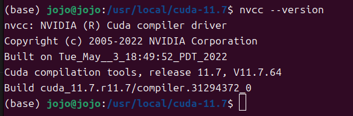
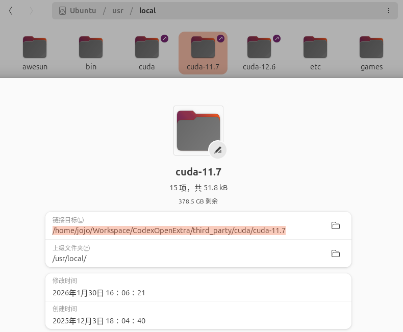
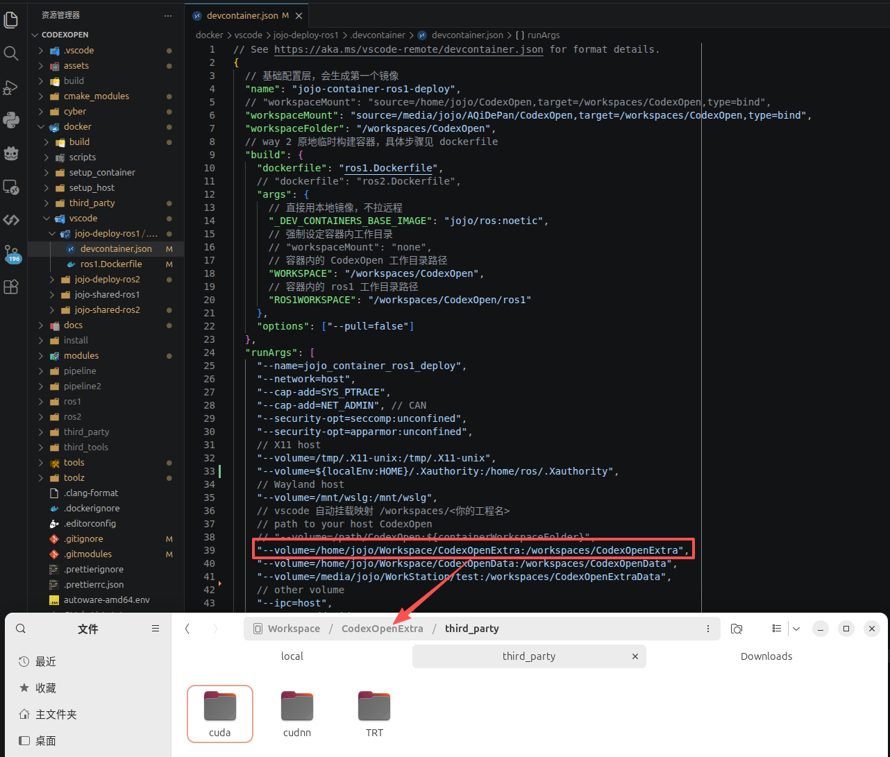
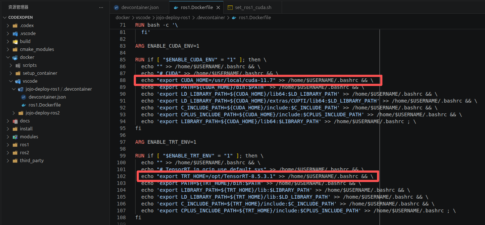
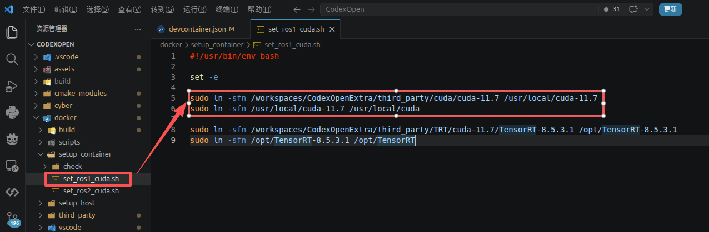
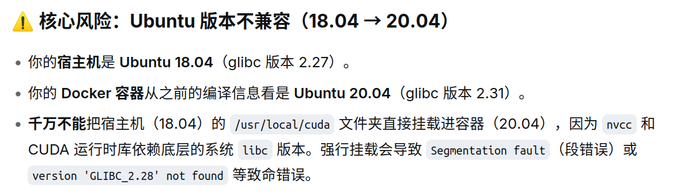

## 1. 安装相关 CUDA 等

各位按自己的需求安装即可；
安装教程省略；

##  2. 主机测试

在主机上执行相关测试命令，检查是否已经在主机上安装成功；

    
    

注意，此处不仅是安装成功，JOJO 还将 `CUDA` 的库文件迁移到 `/path/CodexOpenExtra` 目录，目的是减少 `/根分区` 的存储压力；

- 有此需要的同学，可以仿照 JOJO 做法自行迁移到其他目录；

## 3. 库文件加载

1. 在容器打开前，修改 `devcontainer.json` 中的相关挂载路径为 `/path/CodexOpenExtra` 目录，将物理磁盘映射到容器磁盘中；
- 第一段是 你的实际物理硬盘的路径；
- 第二段是 你要把这个硬盘挂载/映射到容器里的哪个路径；

- 如果你装的是其他版本，一定要修改 `ros1.Dockerfile` OR `ros2.Dockerfile` 中的版本号！！

2. 容器打开后，将容器磁盘中的推理库文件，映射到**容器的官方默认目录**，如`cuda` ==>  `/usr/local/cuda` ，保持路径的一致性；
- 第一段是 你在第一步里映射到容器里的路径；
- 第二段是 该推理库官方默认路径；
- 如果你装的是其他版本，记得修改版本号！！

3. 修改完毕后，按安装的容器版本，执行 `set_ros1_cuda.sh` OR `set_ros2_cuda.sh`，即可；

## Debug

有部分AI会说这种做法有风险，目前 JOJO 在 `ubuntu 24` 链接 `ubuntu 20` 和 `ubuntu 22` 上已经测试成功。
如果后面有同学出现该做法导致的问题，请联系 JOJO。

